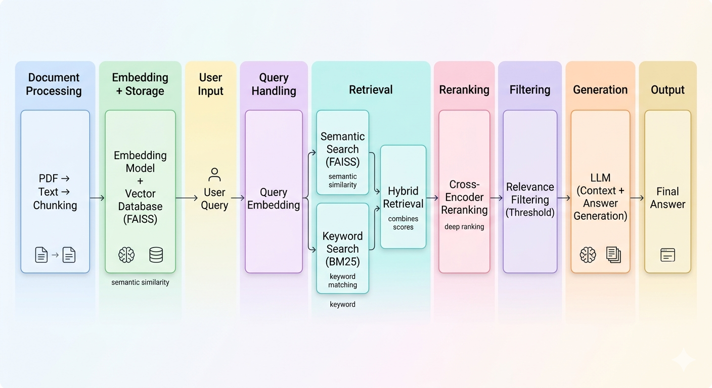

-red>)


# Hybrid RAG Pipeline (From Scratch — No Frameworks)

##  RAG Pipeline Architecture

<p align="center">
  
</p>

<p align="center">
  Hybrid Retrieval + Cross-Encoder Reranking + Guardrails Pipeline
</p>

A fully modular **Retrieval-Augmented Generation (RAG)** system built from scratch using Python — without relying on frameworks like LangChain or LlamaIndex.

This project demonstrates a **practical implementation of RAG systems**, focusing on retrieval quality, ranking strategies, and hallucination control.

---

##  Key Features

- 🔍 Hybrid Retrieval (FAISS + BM25)
- 🎯 Cross-Encoder Reranking (MS MARCO)
- 🛡️ Hallucination Control via Thresholding
- 🧠 Token-Aware Chunking
- ⚡ Fully Modular (No frameworks)
- 🔎 Full Debug Visibility (scores, chunks)

---

## 🚨 What Makes This Different?

Unlike typical RAG projects that rely on frameworks, this system is:

- Built completely **from scratch**
- Designed with **full control over retrieval logic**
- Implements **hybrid search (FAISS + BM25)**
- Includes **custom reranking**
- Provides **debug visibility at every stage**

👉 The goal was not just to build RAG — but to understand _why it fails and how to fix it_

---

##  Overview

This project allows users to:

- Upload PDF documents
- Convert them into searchable knowledge
- Ask natural language questions
- Get answers grounded strictly in the document

---


##  Components

### Loader

- Extracts text from PDFs (PyMuPDF)
- Cleans noisy content

---

### Token-Based Chunking

- Token-aware splitting with overlap

**Why?**

- Preserves semantic meaning
- Avoids context break

---

### Embeddings

- Model: `all-MiniLM-L6-v2`
- Normalized embeddings → cosine similarity via inner product

---

### Vector Store (FAISS)

- `IndexFlatIP`
- Fast semantic similarity search
- ⚠️ Vectorstore is not included. Run `pipeline.build()` to generate it.

---

### Hybrid Retrieval (Core Feature)

#### ❗ Problem

Semantic search alone can fail:

> High similarity ≠ correct answer

#### Solution

- **FAISS** → semantic meaning
- **BM25** → keyword matching
- **Merge + Rerank**

```
Final Score =
0.6 * semantic +
0.3 * bm25 +
0.1 * overlap
```

---

### 🧮 Reranking

Combines:

- semantic score
- keyword score
- token overlap

👉 Ensures best chunks reach LLM

---

### 🛡️ Guardrails

- ❌ No results → fallback response
- ❌ Low score → “I don’t know”
- ✅ Strict prompting (no hallucination)

---

### LLM (Flexible & Replaceable)

The system uses a local LLM (e.g., **Phi-3 via LM Studio**) for answer generation.

**Key Design Choice:**
The LLM layer is intentionally **modular and replaceable**, allowing easy upgrades based on project requirements.

---

###  Why this matters?

Different use cases require different models:

- ⚡ Fast responses → smaller models (Phi-3 Mini)
- 🧠 Higher accuracy → larger models (GPT-4, Claude, etc.)
- 🔒 Privacy → local models
- 🌐 Scalability → hosted APIs

---

###  Supported Options

This pipeline can be easily adapted to use:
Example: Switching from local model to OpenAI only requires updating config values.

- Local models (LM Studio, Ollama)
- OpenAI API (GPT models)
- Hugging Face models
- Any custom LLM endpoint

---

### 🌐 Streamlit UI

- Upload multiple PDFs
- Ask questions interactively
- View retrieved chunks (debug)

---

## ⚠️ Challenges & Fixes

### ❌ Semantic retrieval failure

FAISS ranked incorrect chunks higher

✅ Fixed with:

- BM25 integration
- Hybrid reranking

---

### ❌ Chunk ID collision

Same index across pages caused overwrites

✅ Fixed with:

- Global chunk indexing

---

### ❌ Hallucinated answers

LLM answered beyond context

✅ Fixed with:

- Score threshold guard
- Strict prompt
- Fallback response

---

### ❌ Initialization bug

BM25 failed due to missing metadata

✅ Fixed with:

- Proper pipeline ordering (load → retriever)

---

---

## 🚀 RAG Upgrade: Cross-Encoder + Logging

### 🔄 Upgrade Summary

The system was upgraded from **manual heuristic reranking** to a **Cross-Encoder-based semantic reranking**, along with **structured logging for full observability**.

---

### 🔹 Before (Heuristic Reranking)

- Used manually tuned hybrid score:
  - FAISS similarity
  - BM25 keyword score
  - word overlap
- Limitations:
  - No deep semantic understanding
  - Failed on paraphrased queries
  - Required manual tuning
  - Sometimes ranked incorrect chunks higher

---

### 🔹 After (Cross-Encoder Reranking)

- Model used:cross-encoder/ms-marco-MiniLM-L-6-v2

- Replaced heuristic scoring with:

- Improvements:
- Understands **query + chunk together**
- Captures true semantic relevance
- Handles paraphrased and complex queries
- Reduces irrelevant chunks passed to LLM

---

### 🔹 Embedding & Retrieval Models

This system uses a **dual-model architecture**:

- **Bi-Encoder (Fast Retrieval):**

- Used for embedding generation
- Enables fast FAISS similarity search

- **Cross-Encoder (Accurate Reranking):**

- Evaluates (query, chunk) together
- Provides deep semantic relevance scoring

👉 Combines:
- ⚡ speed (bi-encoder)
- 🎯 accuracy (cross-encoder)

---

### 🔹 Logging Upgrade

Added structured logging across the system:

- Retriever → FAISS, BM25, cross-encoder scores
- Pipeline → query flow, guard decisions
- LLM → context usage

**Why this matters:**

- Easier debugging of retrieval failures  
- Visibility into ranking decisions  
- Better understanding of system behavior  

👉 Transforms the system from a **black box → observable pipeline**

---

### 🧠 Key Insight

Shift from:

👉 *"similar vectors = relevant"*

to:

👉 *"model understands query + text = relevant"*

## 🧠 Design Philosophy

- Transparency over abstraction
- Control over convenience
- Understanding over shortcuts

Every component is manually implemented to expose real-world tradeoffs.

---

## 🔍 Example Query Flow

**Query:** _“What is Python?”_

1. FAISS → semantic chunks
2. BM25 → keyword chunks
3. Merge + rerank
4. Top chunks → LLM
5. LLM generates grounded answer

---

## 📂 Features

- ✅ Manual RAG pipeline
- ✅ Hybrid retrieval (FAISS + BM25)
- ✅ Token-based chunking
- ✅ Multi-document support
- ✅ Debug logs (FAISS / BM25 / Final scores)
- ✅ Guardrails against hallucination
- ✅ Local LLM integration

---

## 🔥 Future Improvements

- Evaluation metrics (precision, recall)
- Improved BM25 preprocessing
- Streaming responses

---

## 🛠️ Tech Stack

- Python
- FAISS
- Sentence Transformers
- Rank-BM25
- PyMuPDF
- Streamlit
- LM Studio (Phi-3)

---

## 📌 Conclusion

This project demonstrates a **deep understanding of RAG systems**, including:

- Retrieval challenges
- Ranking strategies
- Context control
- LLM grounding

👉 Built entirely without frameworks to focus on core concepts.

---

⭐ If you found this useful, consider starring the repo!


## 🚀 Key Features

- 🔍 Hybrid Retrieval (FAISS + BM25)
- 🎯 Cross-Encoder Reranking (MS MARCO)
- 🛡️ Hallucination Control via Thresholding
- 🧠 Token-Aware Chunking
- ⚡ Fully Modular (No frameworks)
- 🔎 Full Debug Visibility (scores, chunks)

A fully modular **Retrieval-Augmented Generation (RAG)** system built from scratch using Python — without relying on frameworks like LangChain or LlamaIndex.

This project demonstrates a **practical implementation of RAG systems**, focusing on retrieval quality, ranking strategies, and hallucination control.

---

## 🚨 What Makes This Different?

Unlike typical RAG projects that rely on frameworks, this system is:

- Built completely **from scratch**
- Designed with **full control over retrieval logic**
- Implements **hybrid search (FAISS + BM25)**
- Includes **custom reranking**
- Provides **debug visibility at every stage**

👉 The goal was not just to build RAG — but to understand _why it fails and how to fix it_

---

## 🚀 Overview

This project allows users to:

- Upload PDF documents
- Convert them into searchable knowledge
- Ask natural language questions
- Get answers grounded strictly in the document

---


## 🔩 Components

### Loader

- Extracts text from PDFs (PyMuPDF)
- Cleans noisy content

---

### Token-Based Chunking

- Token-aware splitting with overlap

**Why?**

- Preserves semantic meaning
- Avoids context break

---

### Embeddings

- Model: `all-MiniLM-L6-v2`
- Normalized embeddings → cosine similarity via inner product

---

### Vector Store (FAISS)

- `IndexFlatIP`
- Fast semantic similarity search
- ⚠️ Vectorstore is not included. Run `pipeline.build()` to generate it.

---

### Hybrid Retrieval (Core Feature)

#### ❗ Problem

Semantic search alone can fail:

> High similarity ≠ correct answer

#### Solution

- **FAISS** → semantic meaning
- **BM25** → keyword matching
- **Merge + Rerank**

```
Final Score =
0.6 * semantic +
0.3 * bm25 +
0.1 * overlap
```

---

### 🧮 Reranking

Combines:

- semantic score
- keyword score
- token overlap

👉 Ensures best chunks reach LLM

---

### 🛡️ Guardrails

- ❌ No results → fallback response
- ❌ Low score → “I don’t know”
- ✅ Strict prompting (no hallucination)

---

### LLM (Flexible & Replaceable)

The system uses a local LLM (e.g., **Phi-3 via LM Studio**) for answer generation.

**Key Design Choice:**
The LLM layer is intentionally **modular and replaceable**, allowing easy upgrades based on project requirements.

---

###  Why this matters?

Different use cases require different models:

- ⚡ Fast responses → smaller models (Phi-3 Mini)
- 🧠 Higher accuracy → larger models (GPT-4, Claude, etc.)
- 🔒 Privacy → local models
- 🌐 Scalability → hosted APIs

---

###  Supported Options

This pipeline can be easily adapted to use:
Example: Switching from local model to OpenAI only requires updating config values.

- Local models (LM Studio, Ollama)
- OpenAI API (GPT models)
- Hugging Face models
- Any custom LLM endpoint

---

### 🌐 Streamlit UI

- Upload multiple PDFs
- Ask questions interactively
- View retrieved chunks (debug)

---

## ⚠️ Challenges & Fixes

### ❌ Semantic retrieval failure

FAISS ranked incorrect chunks higher

✅ Fixed with:

- BM25 integration
- Hybrid reranking

---

### ❌ Chunk ID collision

Same index across pages caused overwrites

✅ Fixed with:

- Global chunk indexing

---

### ❌ Hallucinated answers

LLM answered beyond context

✅ Fixed with:

- Score threshold guard
- Strict prompt
- Fallback response

---

### ❌ Initialization bug

BM25 failed due to missing metadata

✅ Fixed with:

- Proper pipeline ordering (load → retriever)

---

---

## 🚀 RAG Upgrade: Cross-Encoder + Logging

### 🔄 Upgrade Summary

The system was upgraded from **manual heuristic reranking** to a **Cross-Encoder-based semantic reranking**, along with **structured logging for full observability**.

---

### 🔹 Before (Heuristic Reranking)

- Used manually tuned hybrid score:
  - FAISS similarity
  - BM25 keyword score
  - word overlap
- Limitations:
  - No deep semantic understanding
  - Failed on paraphrased queries
  - Required manual tuning
  - Sometimes ranked incorrect chunks higher

---

### 🔹 After (Cross-Encoder Reranking)

- Model used:cross-encoder/ms-marco-MiniLM-L-6-v2

- Replaced heuristic scoring with:

- Improvements:
- Understands **query + chunk together**
- Captures true semantic relevance
- Handles paraphrased and complex queries
- Reduces irrelevant chunks passed to LLM

---

### 🔹 Embedding & Retrieval Models

This system uses a **dual-model architecture**:

- **Bi-Encoder (Fast Retrieval):**

- Used for embedding generation
- Enables fast FAISS similarity search

- **Cross-Encoder (Accurate Reranking):**

- Evaluates (query, chunk) together
- Provides deep semantic relevance scoring

👉 Combines:
- ⚡ speed (bi-encoder)
- 🎯 accuracy (cross-encoder)

---

### 🔹 Logging Upgrade

Added structured logging across the system:

- Retriever → FAISS, BM25, cross-encoder scores
- Pipeline → query flow, guard decisions
- LLM → context usage

**Why this matters:**

- Easier debugging of retrieval failures  
- Visibility into ranking decisions  
- Better understanding of system behavior  

👉 Transforms the system from a **black box → observable pipeline**

---

### 🧠 Key Insight

Shift from:

👉 *"similar vectors = relevant"*

to:

👉 *"model understands query + text = relevant"*

## 🧠 Design Philosophy

- Transparency over abstraction
- Control over convenience
- Understanding over shortcuts

Every component is manually implemented to expose real-world tradeoffs.

---

## 🔍 Example Query Flow

**Query:** _“What is Python?”_

1. FAISS → semantic chunks
2. BM25 → keyword chunks
3. Merge + rerank
4. Top chunks → LLM
5. LLM generates grounded answer

---

## 📂 Features

- ✅ Manual RAG pipeline
- ✅ Hybrid retrieval (FAISS + BM25)
- ✅ Token-based chunking
- ✅ Multi-document support
- ✅ Debug logs (FAISS / BM25 / Final scores)
- ✅ Guardrails against hallucination
- ✅ Local LLM integration

---

## 🔥 Future Improvements

- Evaluation metrics (precision, recall)
- Improved BM25 preprocessing
- Streaming responses

---

## 🛠️ Tech Stack

- Python
- FAISS
- Sentence Transformers
- Rank-BM25
- PyMuPDF
- Streamlit
- LM Studio (Phi-3)

---

## 📌 Conclusion

This project demonstrates a **deep understanding of RAG systems**, including:

- Retrieval challenges
- Ranking strategies
- Context control
- LLM grounding

👉 Built entirely without frameworks to focus on core concepts.

---

⭐ If you found this useful, consider starring the repo!
